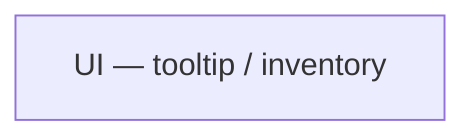

# Night run — 2026-07-01

## Headline

6 chunks (issues #3–#8) driving the item tooltip redesign to near-completion; 5 of 8 slices
done and label-cleared, #8 (Alt-expansion) two-thirds done with the reactor-equation /
weapon-terminal half still open — all on branch `night/2026-07-01`, awaiting verification.

## Systems touched

Everything landed inside `Assets/Code/Runtime/UI/Inventory/` and its EditMode tests
(`Assets/Code/Tests/EditMode/UI/`) — no other assembly was touched.

## What moved

- #3 Type-glyph vocabulary (TypeGlyphs) + render in item header — label-cleared — 1 commit — VERIFY: TMP atlas renders the glyphs (⚔◈◆▸⇄↻), else flip `UseAsciiFallback`; run `TypeGlyphsTests` + `ChainResolverTests`.
- #4 Delivery verb-led sentence (DeliverySentence) — label-cleared — 1 commit — VERIFY: hover a weapon/payload and confirm it reads as a sentence, not axis words; run `DeliverySentenceTests`.
- #5 Positional delta model — weapon terminal totals + piece list — label-cleared — 1 commit — VERIFY: hover a driving weapon shows terminal totals + glyph piece list; a payload header shows just "Payload"; run `PositionalDeltaTests`.
- #6 Per-attachment delta views (amplifier/reactor/shifter/converter) — label-cleared — 1 commit — VERIFY: hover a chained reactor shows firing-condition + input mod; run `AttachmentDeltaTests`.
- #7 Symmetric two-state (both states shown, active emphasized) — label-cleared — 1 commit — VERIFY: hover an attachment shows chained (bold) / unchained (dim) both, flips when standalone; hover a weapon shows a dim "as payload"/"as driving weapon" line; run `TwoStateBlockTests`.
- #8 Alt expands math + breadcrumb; remove inverted arrow diagram — still `ready-for-agent` — 2 commits — VERIFY: holding Alt on a chained piece shows a single-line breadcrumb in grid order (no `↓` arrows); holding Alt on a converter piece expands to "Single → Aoe" / "pool Mana → Health"; run `BreadcrumbTests` + `AxisDeltaTests`. **Remaining scope:** reactor `[base] ×mod% = result` equation and weapon `base → final` terminal under Alt — not yet committed (see Review).

All chunks also pass the shared regression lock: `ChainResolverTests`.

## Review

Branch to review: `night/2026-07-01`
`git checkout night/2026-07-01`

Nothing has been merged to `main`. Note: the working tree also carries **uncommitted**
changes to `ItemTooltipController.cs` and `PositionalDelta.cs`, plus a new untracked
`TerminalEquationTests.cs` — an in-progress attempt at #8's remaining reactor-equation slice
that stopped short of a commit. Review it before either continuing or discarding.
