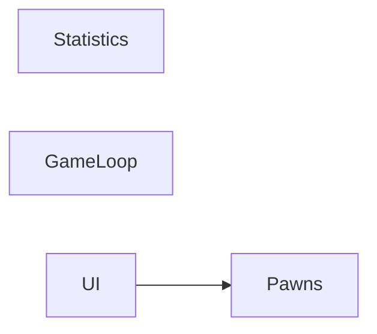

# Night run — 2026-07-02

## Headline

Completed the 5-slice Pawn-UI series (#11–#15) across the Statistics, GameLoop, Pawns and UI systems; all on branch `night/2026-07-02`, awaiting Rider/Unity verification and human prefab/panel wiring.

## Systems touched



## What moved

- #11 Statistics seam — advanced — 2 commit(s) — VERIFY: EditMode `StatTests`(3) + `ResourceTests` zero-max percentage green; `ChainResolverTests`/`PawnStatsTests` still green.
- #12 Click-selection — advanced — 2 commit(s) — VERIFY: EditMode `HexSelectionPolicyTests`(4) green; play-mode click-select / switch / keep / no-toggle and Q/E rotates the selected pawn.
- #13 Inventory-trigger swap — advanced — 2 commit(s) — VERIFY: hover no longer changes the inventory panel; clicking a pawn shows its inventory, clicking another switches.
- #14 Grid status bar — advanced — 2 commit(s) — VERIFY: wire `Pawn.prefab` canvas child + 2 bars; play: all pawns show correct initial fill, 0-mana no NaN, bars track combat.
- #15 Selected-pawn HUD — advanced — 2 commit(s) — VERIFY: compiles (new `IPawn.Icon`/`DisplayName`; `StubPawn` satisfies `IPawn`) + EditMode green; author HUD panel (`PawnHudView` on always-active parent, child `_root`); play: select pawns both teams → HUD swaps, numbers live, chaining a LifeMax/range item updates max live, 0-mana shows `0 / 0`.

Note: each slice is code-complete only; #14 and #15 additionally need human prefab/panel authoring + SerializeField wiring in Unity before they can be verified in play mode.

## Review

Branch to review: `night/2026-07-02`

```
git checkout night/2026-07-02
```

Nothing was merged to `main`.
